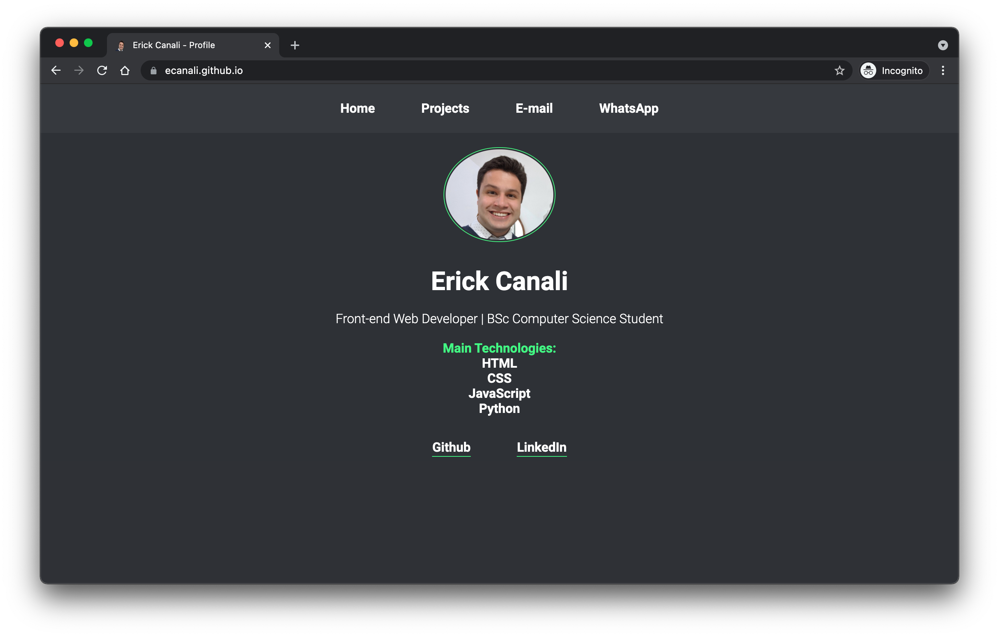
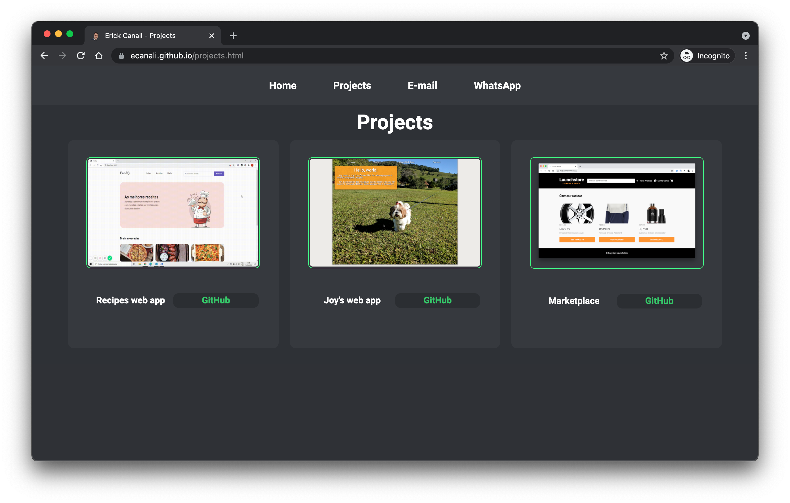
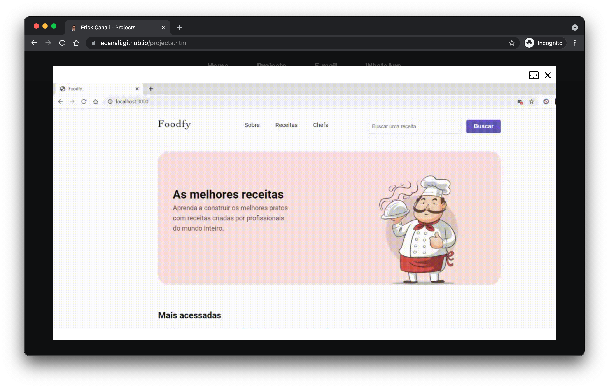

<h1 align="center">
    
</h1>

<h1 align="center">Erick Canali's Profile Web App</h1>

This is a simple Personal Page style app featuring some of my other projects and professional information.

---

Table of contents
=================
<!--ts-->
   * [Technologies](#-technologies)
   * [Features](#-features)
   * [Layout](#-layout)
   * [How to download and execute the project](#-how-to-download-and-execute-the-project)
   * [Licence](#-licence)
<!--te-->

---

## Technologies <a name="-technologies" style="text-decoration:none"></a>
* [HTML](https://developer.mozilla.org/en-US/docs/Web/HTML)
* [CSS](https://developer.mozilla.org/en-US/docs/Web/CSS)
* [Javascript](https://www.javascript.com/)

---

## Features <a name="-features" style="text-decoration:none"></a>

- [x] Links to direct contacts and social media
- [x] Modal manipulation for better showing the projects images
- [x] Web app put online with GitHub Pages accessing https://ecanali.github.io/

---

## Layout <a name="-layout" style="text-decoration:none"></a>

### Home
<a href="https://ecanali.github.io/index.html" target="_blank">
    
</a>

### Projects
<a href="https://ecanali.github.io/projects.html" target="_blank">
    
</a>

### Opened modal
<a href="https://ecanali.github.io/projects.html" target="_blank">
    
</a>
---

## How to download and execute the project <a name="-how-to-download-and-execute-the-project" style="text-decoration:none"></a>

```bash

# In a terminal/cmd window, clone this repository
$ git clone https://github.com/ecanali/ecanali.github.io

# Access the project folder
$ cd ecanali.github.io

# Open the index.html file in your browser
$ open index.html

```

---

## Licence <a name="-licence" style="text-decoration:none"></a>

This repository is licensed by **MIT LICENSE**. For detailed information, read the file [LICENSE](https://github.com/ecanali/ecanali.github.io/blob/master/LICENSE). 

Made with ♥ by Erick Canali :wave: